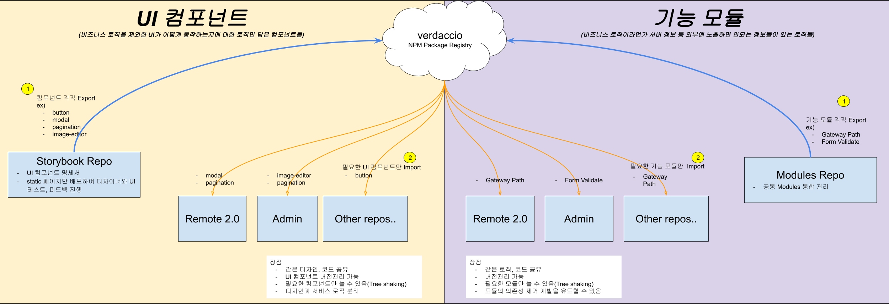

# Function_Modules

## 참고

- [Github Verdaccio Page](https://github.com/verdaccio/verdaccio)

## Workflwo



## 설명

NPM Registry를 사내 개발서버에 구축하여 필요한 패키지들은 모두 회사내부망안에서 관리되도록 함.
단, 코드형상관리, 작업자추적 등의 히스토리 관리등은 Github 레포로 Monorepo의 형태로 관리. 

## 예시용 기능리스트

- gateway : Gateway path 모음
- v-validate : User Form Validation

## 사용법

#### verdaccio 실행

- local by global
```
$ npm install --global verdaccio

$ verdaccio
```

- docker
```
$ docker pull verdaccio/verdaccio

// 도커 작동 취소시 데이터 유실됨. volume 계속 살릴려면 옵션 줘야함
$ docker run -it --rm --name verdaccio -p 4873:4873 verdaccio/verdaccio
```

###### publish

- 필수조건
  - 작업중인 로컬의 package.json안에 ```private: true``` 가 없어야 함.
  - package.json의 name필드에 ```@virnect:<패키지 이름>``` 형식으로 scope가 포함되어야함. 그래야 import시 @virnect는 구축형 verdaccio에서 데이터 가져옴. 안그러면 verdaccio에 올려놓은 프로젝트를 default registry인 http://registry.npmjs.org 에서 가져옴(== 에러).
  - ```--registry```옵션을 안 줄 경우 default registry인 http://registry.npmjs.org 에 퍼블리싱됨. 주의!!!!!
```bash
$ npm publish --registry http://<내부 Verdaccio IP>:<내부 Verdaccio 포트>

// ex)
$ npm publish --registry http://localhost:4873
```

###### import

1. .npmrc 파일을 루트에 만들고 아래 내용 입력
  ```
  registry=http://registry.npmjs.org/
  @virnect:registry="http://localhost:4873"
  ```
2. npm i
